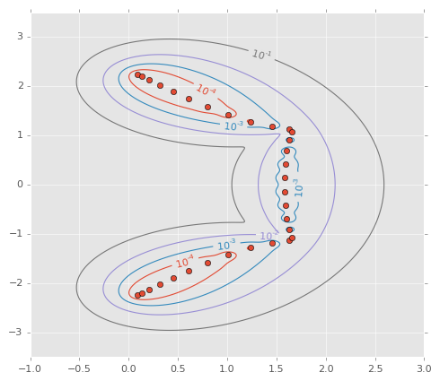

# PseudoPy [](https://travis-ci.org/andrenarchy/pseudopy)

PseudoPy computes and visualizes the pseudospectrum of a matrix. It is a Python version of the original [eigtool](http://www.cs.ox.ac.uk/pseudospectra/eigtool/) by Thomas G. Wright. The algorithms used in this package can be found in the book [Spectra and pseudospectra](http://press.princeton.edu/titles/8113.html) by [Nick Trefethen](http://www.maths.ox.ac.uk/people/profiles/nick.trefethen) and [Mark Embree](http://www.caam.rice.edu/~embree/).

## Example
The pseudospectrum of the Grcar matrix looks like this:



If no knowledge about the location of the pseudospectrum of the given matrix is available, the following lines of code can be used to obtain an approximation:
```python
from pseudopy import NonnormalAuto, demo
from matplotlib import pyplot
from scipy.linalg import eigvals

# get Grcar matrix
A = demo.grcar(32).todense()

# compute pseudospectrum for the levels of interest between [1e-5, 1]
pseudo = NonnormalAuto(A, 1e-5, 1)

# plot
pseudo.plot([10**k for k in range(-4, 0)], spectrum=eigvals(A))
pyplot.show()
```

## Installation
```pip install pseudopy```

Note that you may need to add `sudo` if you want to install it system-wide.

## License
PseudoPy is free software licensed under the [MIT License](http://opensource.org/licenses/mit-license.php).
